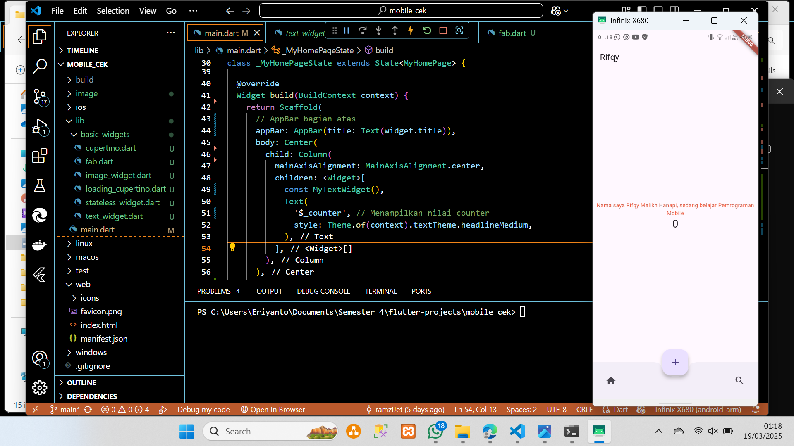
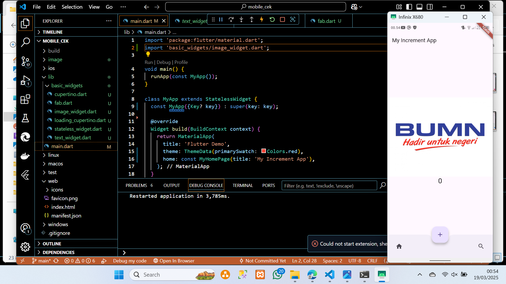
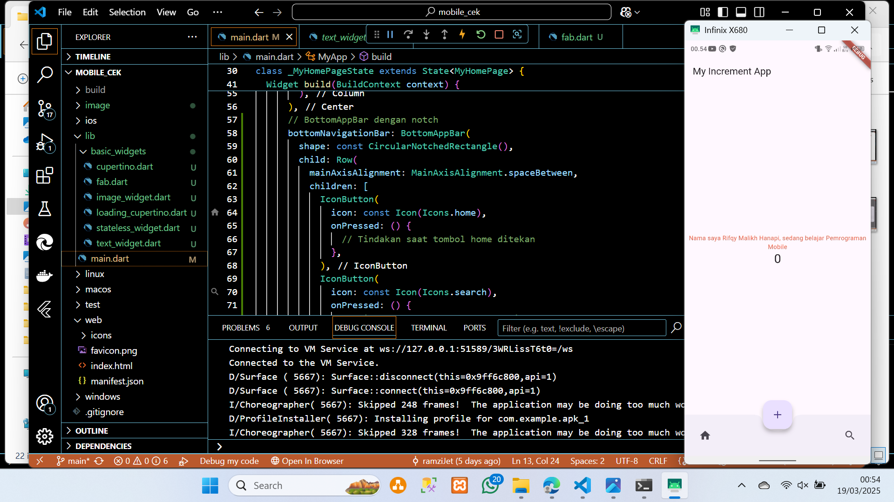
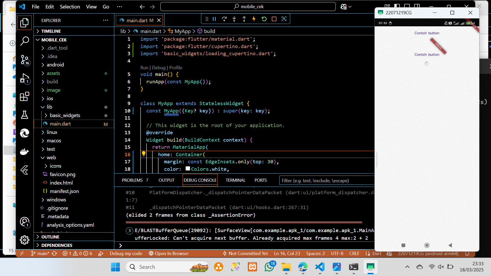
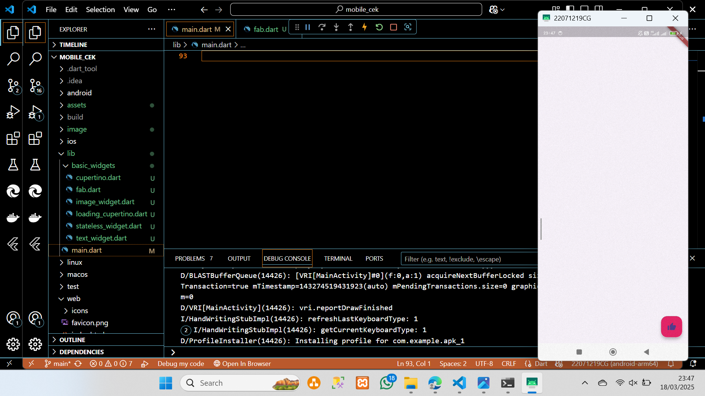
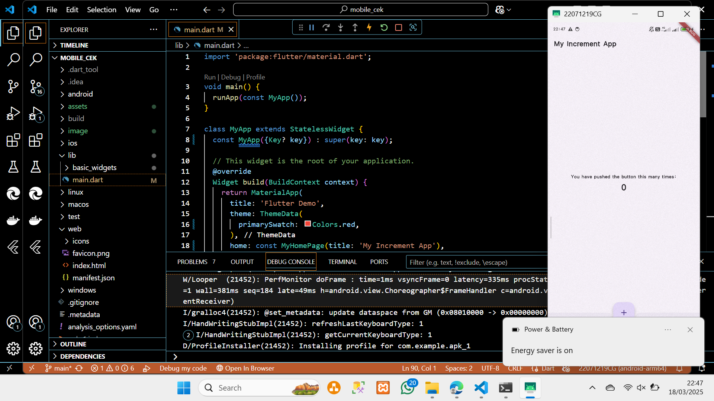
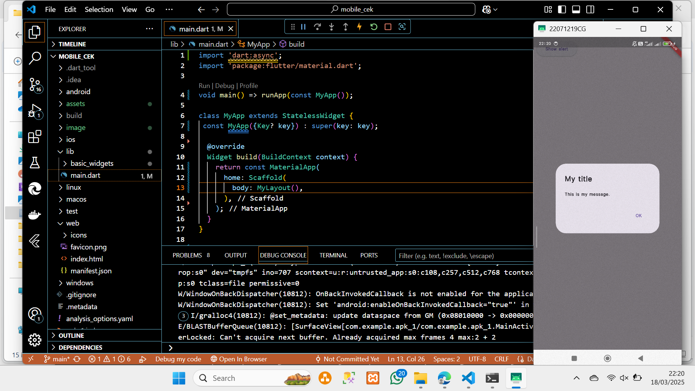
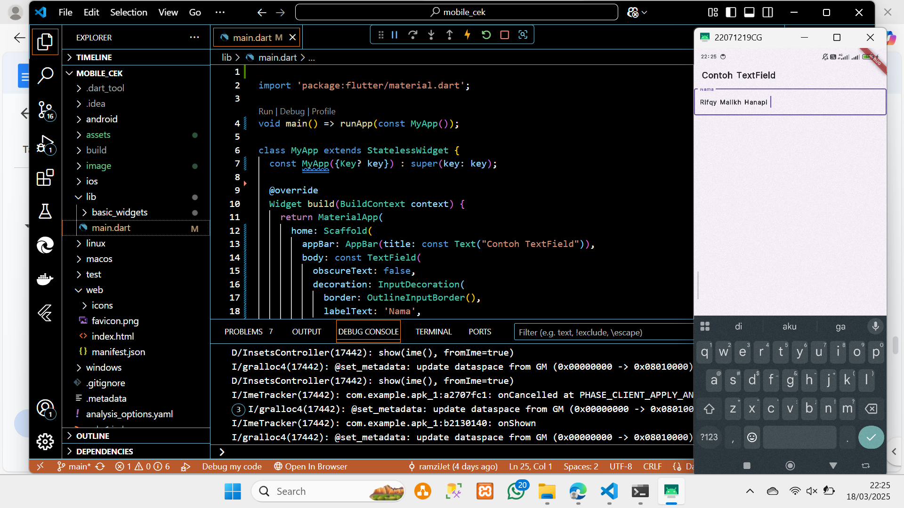
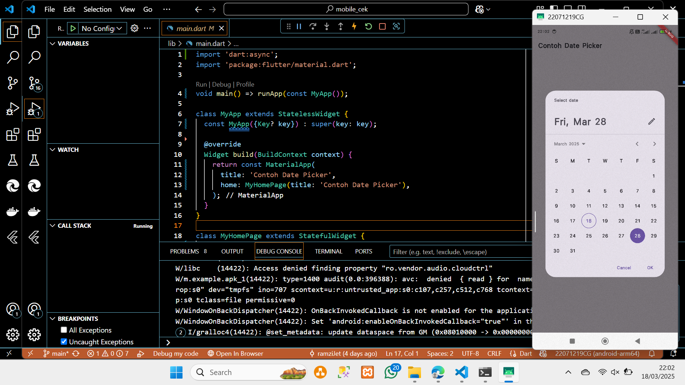

# apk_1

PROJECT HELLO WORLD!!
## Getting Started

A new Flutter project
Praktikum 3

Berikut merupakan hasil dari praktikum 3 hello word, di sini saya
mengganti judul dengan nama saya.

Praktikum 4

Berikut dari hasil text widget dimana saya membuat file widget text dan
diimport di main hasilnya seperti gambar di atas.

Berikut dari hasil logo widget dimana saya membuat file widget logo dan disimpan lalu
diimport sehingga logo muncul dikarenakan file logo saya taruh di aset dan dipanggin di logo widget dan main.

Praktikum 5

Berikut hasil dari cupertino button yg dimana ada button di bacaannya.

FAB disini terdapat button tambahan pada kanan bawah.

Pada hasil fase ini ada perubahan button plus yang mengambang di tengah.

Disini main dart diubah sehingga pada kiri atas akan ada button show dialoge,
dan bila ditekan akan menampilkan pesan.

Berikut hasil dari input yang diganti adalah code pada main dart,
yang dihasilkan kita dapat menginput kata sebagai contoh saya menginput nama saya.

Berikut adalah hasil dari date and time pikers dimana saya menambahkan
code baru yang bertujuan untuk memilih tanggal.